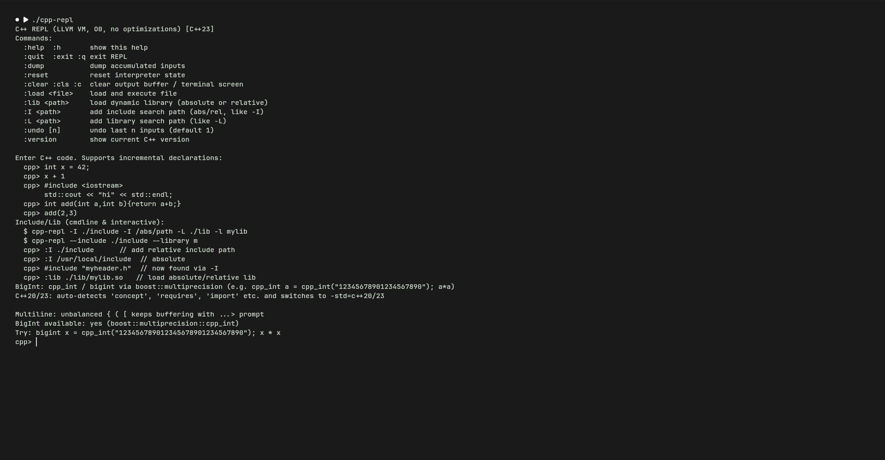

# cpp-repl — C++ REPL like Python

<p align="center">
  
  <br/>
  <em>Python-like incremental REPL for C++ — no <code>main()</code>, just raw C++</em>
</p>

<p align="center">
  <a href="https://github.com/sergiorandria/cpp-repl/actions/workflows/ci.yml"></a>
  <a href="https://github.com/sergiorandria/cpp-repl/actions/workflows/format.yml"></a>
  <a href="https://github.com/sergiorandria/cpp-repl/actions/workflows/codeql.yml"></a>
  <a href="https://opensource.org/licenses/MIT"></a>
  <a href="https://en.cppreference.com"></a>
  <a href="https://llvm.org"></a>
  <a href="https://github.com/sergiorandria/cpp-repl/commits/main"></a>
</p>

<p align="center">
  <b>Low-level C++ REPL built on the LLVM VM.</b> &nbsp;•&nbsp; <code>LLJIT</code> + <code>clang::Interpreter</code> &nbsp;•&nbsp; <code>O0</code> correctness-first &nbsp;•&nbsp; auto <code>-std</code> &nbsp;•&nbsp; BigInt &nbsp;•&nbsp; hot <code>-I</code>/<code>-L</code>/<code>-l</code>
</p>

---

## ⚡️ Why cpp-repl?

| Traditional C++ | **cpp-repl** |
|---|---|
| Need `int main(){}` + recompile | **Just type raw C++** — `int x = 42;  x+1` |
| `g++ file.cpp && ./a.out` | **`./build/cpp-repl file.cpp`** or `:load file.cpp` |
| Manual `-std=c++20` for concepts | **Auto-detects** `concept`/`requires`/`import` → switches to C++20/23 |
| No Python-like ints | **`cpp_int` / `bigint`** arbitrary precision out of the box |
| Absolute paths are painful | **`-I ./inc -I /abs/path -L ./lib -l mylib`** cmdline **and** interactive `:I`/`:L`/`:lib` |

> Think `python` but for C++. Incremental state, value printing `(type) value`, diagnostics on stderr, history + undo.

## 🎬 30-second demo

```bash
./build/cpp-repl
cpp> int x = 42;
cpp> x + 1
(int) 43

cpp> #include <iostream>
cpp> std::cout << "hi" << std::endl;
hi

cpp> auto f = [](double v){ return v*v; };
cpp> f(234.23423948934894)
(double) 54865.278...

cpp> cpp_int a = cpp_int("123456789012345678901234567890");
cpp> a * a
123456789012345678901234567890 * 123456789012345678901234567890 = 152415...
```

Pipes & scripts work like Python:

```bash
echo 'int x=42; x+1' | ./build/cpp-repl
./build/cpp-repl --no-interactive -e 'int x=5; x*2' -e 'x+10'
./build/cpp-repl examples/hello.cpp --no-interactive
echo 'cpp_int a=cpp_int("12345678901234567890"); a*a' | ./build/cpp-repl
```

## ✨ Features

- **🧠 LLVM VM core** — `llvm::orc::LLJIT` in-process JIT, `LLVMContext`/`Module`/`IRBuilder`, pluggable `core::VM` interface (swap to `RemoteJIT`)
- **🩺 Clang frontend** — `clang::Interpreter` incremental parser + ORC executor, real C++ parsing (not a toy)
- **🔄 Incremental REPL** — `repl::Session` with `cpp>` / `...>` multiline, history, `:undo`, `:reset`, `:dump`, `:clear`
- **🎯 Auto C++ version** — `C++17` default; upgrades to `C++20` on `concept`/`requires`/`co_await`/`<=>`/`consteval`, to `C++23` on `import`/`module`
- **🔢 BigInt** — `boost::multiprecision::cpp_int` (`bigint` alias) + `mpz_int` if GMP present; strings wrapped as `cpp_int("...")` to avoid literal overflow
- **📁 Includes & libs** — absolute + relative `-I`/`-L`/`-l`/`-D` on cmdline **and** live `:I <path>` / `:L <path>` / `:lib <path>`; survives version upgrades
- **🎨 Precise floats** — `float 9`, `double 17`, `long double 21` digits (`max_digits10`) instead of truncated `%6g`/`%8g`
- **🧪 No optimizations** — always `-O0 -g -fno-exceptions -fno-rtti`, diagnostics → stderr, `llvm::Error` handling

## 🏗️ Architecture (scalable)

```
User Input (raw C++ like Python, no main)
       │
       ▼
┌─────────────────────────────────────────┐
│  cli::parse (src/cli)                   │  ← Options, --scaffold, -e, files
└──────────────┬──────────────────────────┘
               ▼
┌─────────────────────────────────────────┐
│  utils::VersionDetector (src/utils)     │  ← auto-detects C++17/20/23
│   import, concept, requires, co_await   │
└──────────────┬──────────────────────────┘
               ▼
┌─────────────────────────────────────────┐
│  interpreter::Interpreter (src/interpreter) │ ← wraps clang::Interpreter + ORC JIT
│   + utils::BigIntSupport preamble           │    auto -std, bigint, high-prec floats
└──────────────┬──────────────────────────┘
               ▼
┌─────────────────────────────────────────┐
│  core::VM / LLJITVM (src/core)          │  ← llvm::orc::LLJIT, pluggable backends
│   IR: LLVMContext, Module, IRBuilder    │
└──────────────┬──────────────────────────┘
               ▼
┌─────────────────────────────────────────┐
│  repl::Session (src/repl)               │  ← prompts, multiline, :commands
└─────────────────────────────────────────┘
```

Each layer is an isolated module with a stable interface — swap `LLJIT` for `RemoteJIT`, add a new frontend, or extend `utils` without touching the rest.

## 🚀 Build

**Requires:** LLVM 22 + Clang 22 (with `clangInterpreter`)

```bash
cmake -B build -DCMAKE_BUILD_TYPE=Debug
cmake --build build -j
./build/cpp-repl
```

> Debug is default (`O0`). Release: `-DCMAKE_BUILD_TYPE=Release`.

## 💻 CLI (interpreter-like, no `main`)

```bash
cpp-repl [options] [file ...]
  -h, --help           show help
  -v, --version        show version (0.3.0 + LLVM 22.1.3)
  --scaffold           show low-level VM IR demo (hidden by default)
  --no-interactive     exit after file/-e execution (script mode, like python)
  -e <code>            execute raw C++ code (no main needed)
  -I <path>            add include path (absolute or relative, repeatable)
  -L <path>            add library search path
  -l <lib>             link library (e.g. -l m -l gmp, also .so path)
  -D <macro>           define macro (e.g. -DDEBUG=1)
  --include <path>     same as -I
  --library <lib>      same as -l
  <file>               execute raw C++ file as script (like python script.py)
```

**Examples — no `int main()` needed:**

```bash
./build/cpp-repl                          # interactive REPL, raw code
./build/cpp-repl examples/hello.cpp       # run file as script then REPL
./build/cpp-repl --no-interactive examples/hello.cpp  # script only
./build/cpp-repl -e 'int x=5; x*2' --no-interactive  # -e raw code
echo 'int x=42; x+1' | ./build/cpp-repl   # pipe like python
echo 'cpp_int a = cpp_int("12345678901234567890"); a*a' | ./build/cpp-repl

# absolute & relative includes + libraries (cmdline)
./build/cpp-repl -I ./include -I /abs/path -L ./lib -l mylib -e '#include "myheader.h"'
./build/cpp-repl -I ./rel_include --library m --no-interactive -e 'extern "C" int mylib_add(int,int); mylib_add(2,3)'
```

## ⌨️ REPL Commands

Inside `cpp>`:

```
:help  :h               show help
:quit :exit :q          exit REPL
:dump                   dump history + current C++ version
:reset                  reset interpreter state
:clear :cls :c          clear output buffer / terminal screen
:load <file>            load raw C++ file
:lib <path>             load dynamic library (abs/rel, e.g. :lib ./lib/mylib.so)
:I <path>               add include search path (abs or rel, like -I)
:L <path>               add library search path (like -L)
:undo [n]               undo last n
:version                show current -std version
```

Multiline: unbalanced `{ ( [` keeps buffering with `...>` prompt.

## 📂 Include & Library (absolute/relative, cmdline & interactive)

Both **absolute** (`/usr/local/include/mylib.h`) and **relative** (`./include/mylib.h`, `../common/header.h`) are supported.

**Cmdline (like `g++ -I/-L/-l`):**

```bash
# Include: absolute + relative
cpp-repl -I ./rel_include -I /tmp/abs_include -e '#include "myheader.h"'

# Library: absolute .so path, or -L + -l search
cpp-repl -l /tmp/abs_mylib.so -e 'extern "C" int mylib_add(int,int); mylib_add(5,10)'
cpp-repl -L ./tmp_lib -l mylib -e 'extern "C" int mylib_add(int,int); mylib_add(2,3)'
cpp-repl -I ./include -L ./lib -l mylib --library gmp -D DEBUG=1

# Combined with file/script
cpp-repl -I ./include -L ./lib -l mylib examples/use_mylib.cpp --no-interactive
```

**Interactive:**

```cpp
cpp> :I ./rel_include           // relative
cpp> :I /tmp/abs_include        // absolute
cpp> #include "myheader.h"      // now found
cpp> rel_func()                 // (int) 200

cpp> :L ./tmp_lib
cpp> :lib mylib                 // bare -l name, searches -L paths
cpp> :lib ./tmp_lib/libmylib.so // absolute/relative .so
cpp> extern "C" int mylib_add(int,int);
cpp> mylib_add(7,8)             // (int) 1015
```

> Paths are stored and survive C++ version upgrades (e.g. `:I` then `concept` → still keeps includes).

## 🧬 C++ Version Support (auto-detect)

Interpreter auto-detects required `-std`:

- **C++17** default
- **C++20** if code contains `concept`, `requires`, `co_await`, `co_yield`, `char8_t`, `<=>`, `consteval`
- **C++23** if code contains `import`, `module`/`export`

```cpp
cpp> template<typename T> concept Addable = requires(T a,T b){ a+b; };
cpp> Addable auto x = 42;  // auto-detects C++20, re-inits to -std=c++20
cpp> import std;  // C++23
```

No manual `-std` needed — upgrades are replay-safe (history is re-executed on new `CompilerInstance`).

## 🔢 BigInt — Very Large Numbers (GMP/mpz)

Like Python's arbitrary large ints, via `boost::multiprecision`:

```cpp
cpp> cpp_int a = cpp_int("1234567890123456789012345678901234567890");
cpp> cpp_int b = cpp_int("987654321098765432109876543210");
cpp> cpp_int c = a * b; c   // prints big int via std::cout

cpp> bigint x = cpp_int("999999999999999999999999999999");  // alias
cpp> x * x
```

`bigint` is `boost::multiprecision::cpp_int` (header-only). If GMP is installed, also `mpz_int` / `gmp.hpp` is available and linked via `-lgmp -lgmpxx`. Large literals are auto-wrapped as `cpp_int("...")` to avoid `integer literal is too large`.

Demo: `examples/bigint.cpp`

## 📚 Examples

See `examples/`:

- `hello.cpp` — basic I/O and value printing
- `functions.cpp` — incremental function definitions (persistence)
- `class.cpp` — structs, classes, templates
- `bigint.cpp` — big integers
- `version_concept.cpp` — C++20 concepts

Load with `:load examples/hello.cpp` or `./build/cpp-repl examples/class.cpp`

## 🔬 Low-level VM detail

- `include/cpp-repl/core/vm.h` + `src/core/vm.cpp` — raw `llvm::orc::LLJIT` wrapper via `core::VM` interface (pluggable). Manually builds LLVM IR (`LLVMContext`, `Module`, `IRBuilder`) and JIT-executes without Clang.
- `include/cpp-repl/interpreter/interpreter.h` — `interpreter::Interpreter` wraps `clang::Interpreter` + `VersionDetector` + `BigIntSupport` preamble. Handles raw code without `main`.
- Legacy `src/vm.h` / `src/repl.h` kept as wrappers for backward compat.

All builds are `-O0 -g -fno-exceptions -fno-rtti` to stay close to the VM.

## 🗂️ Project Structure (scalable)

```
include/cpp-repl/
  core/vm.h
  interpreter/interpreter.h
  utils/version_detector.h, bigint.h
  repl/session.h
  cli/cli.h
src/
  core/vm.cpp
  interpreter/interpreter.cpp   # high-precision float printing (9/17/21 digits)
  utils/version_detector.cpp, bigint.cpp
  repl/session.cpp
  cli/cli.cpp
  main.cpp (delegates to modules)
examples/
  hello.cpp, functions.cpp, class.cpp, bigint.cpp, version_concept.cpp
```

## ✅ CI & Quality

- **CI** (`ci.yml`): Ubuntu 24.04, LLVM 22, `Debug` + `Release`, smoke tests (`-e`, pipe, examples, BigInt, C++20 concepts, float precision)
- **Format** (`format.yml`): `clang-format-22` + whitespace + `cppcheck`
- **CodeQL** (`codeql.yml`): weekly security analysis (C++)
- **Release** (`release.yml`): builds tarball on `v*` tags via `softprops/action-gh-release`

Enable branch protection on `main` to require `Build (ubuntu-24.04, Debug, LLVM 22)` before merge.

## 🤝 Contributing

See [CONTRIBUTING.md](CONTRIBUTING.md). PRs welcome — run `clang-format` and `cmake --build build -j` before pushing.

## 📄 License

MIT — see [LICENSE](LICENSE)
